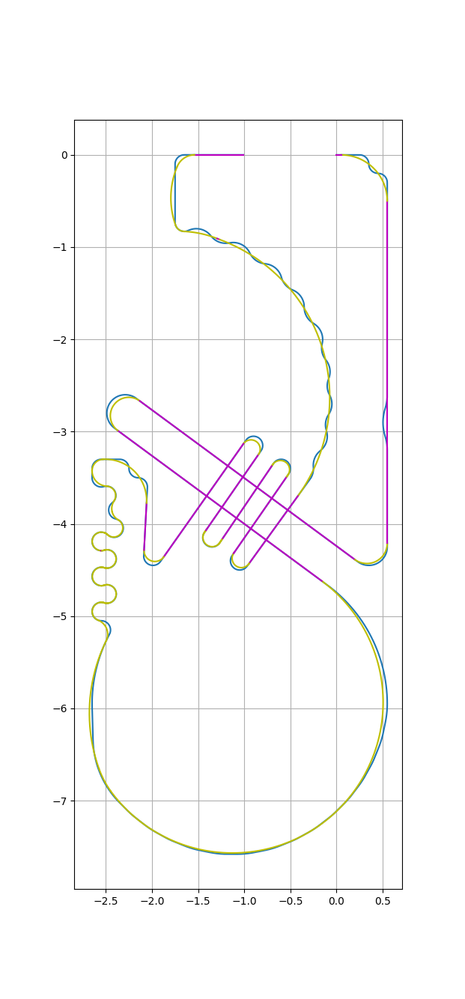

# robotrace-shortcut-path

ロボトレース競技のためのショートカット経路生成方法です．

```
python generate_shortcut_path.py
```
(処理時間がかなり長いですが，pythonの仕様です．)

## 方法
適当なノード・アークを定義し，グラフの最短経路問題として解いています．ライン，およびラインを平滑化した経路(平滑化経路)上の点をノードとし，これらに接する直線・円弧をアーク(ショートカット)として利用しています．

## 実行例；

